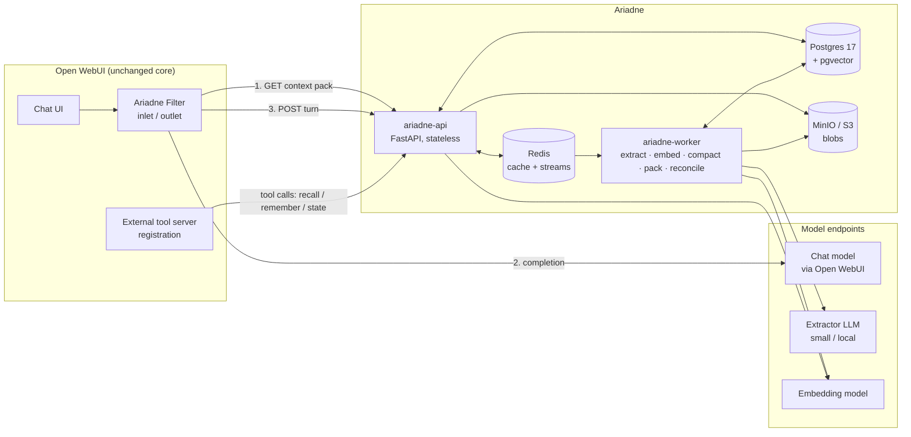
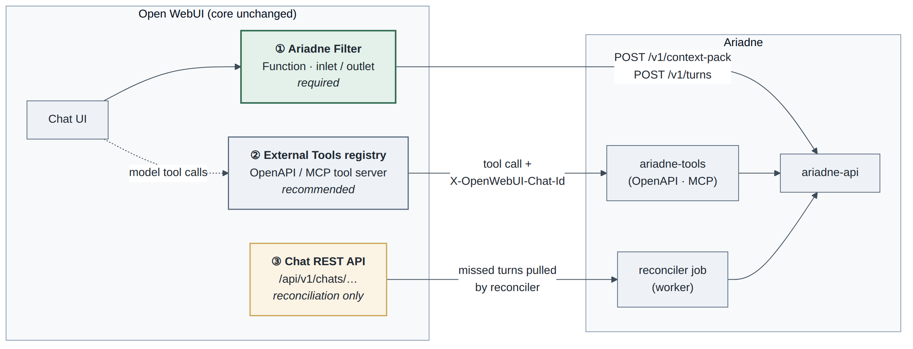
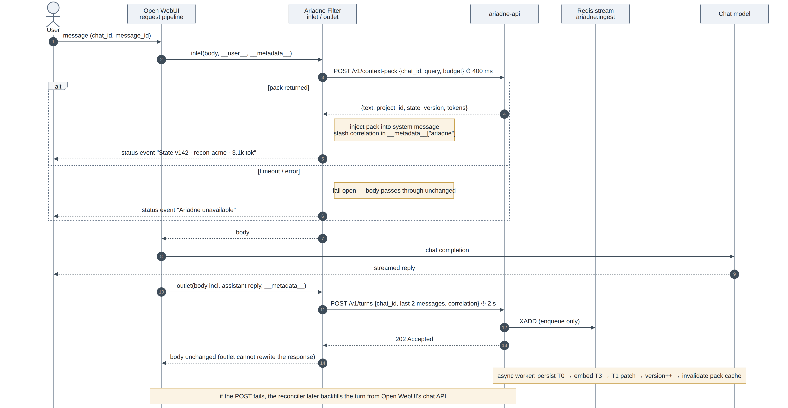
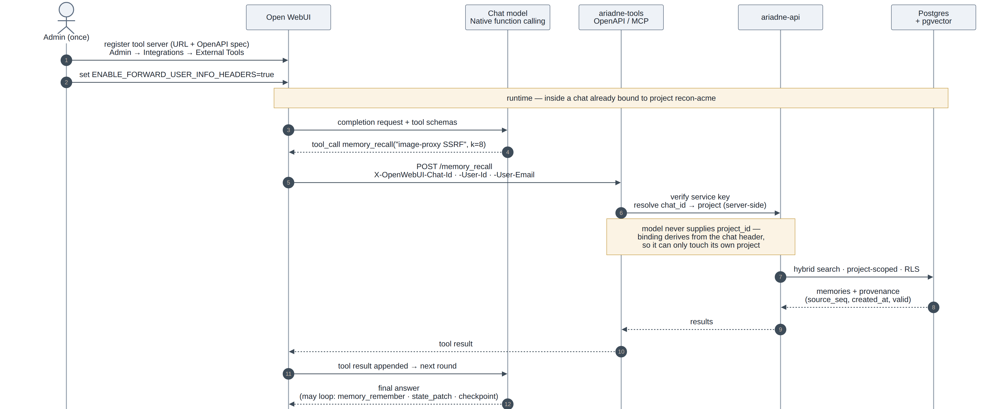
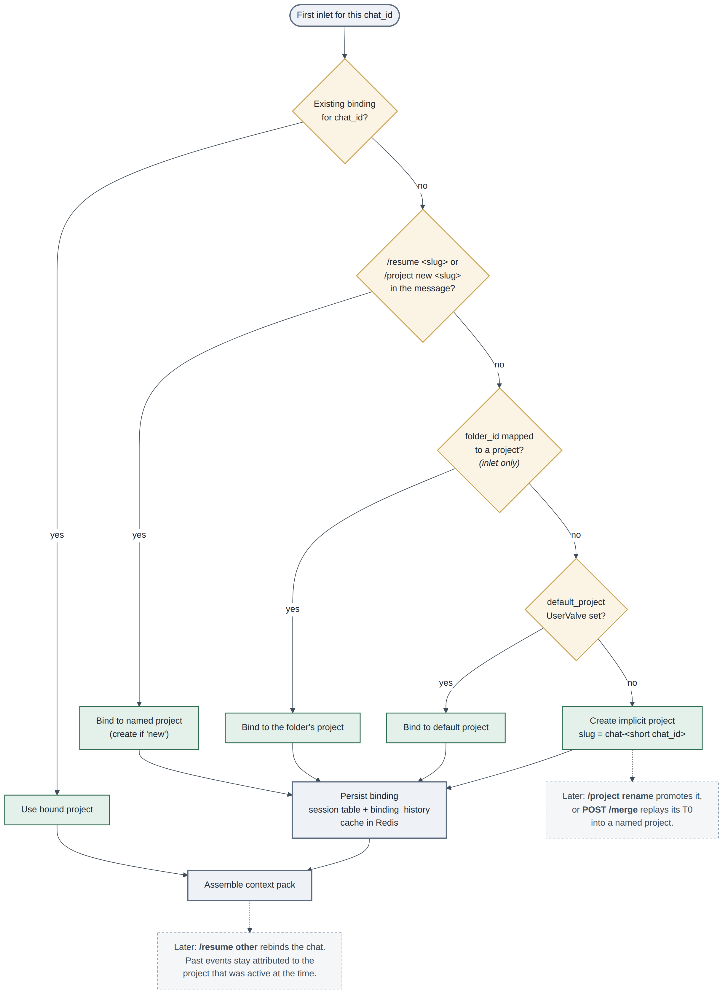

# Ariadne — External Conversation-State Service for Open WebUI

**Status:** Proposed (v0.1)
**Date:** 2026-09-09
**Scope:** Architecture, data model, integration contract, storage, security, rollout

> "Ariadne" is a working codename (the thread through the labyrinth). Rename freely.

---

## 1. Problem

Open WebUI stores chat history, but the *model* only ever sees what fits in the current request window. Long-running work — a multi-week assessment, a reverse-engineering effort, an evolving codebase — outgrows that window. The usual workaround is a hand-maintained "state block" pasted into the system prompt or first message: decisions, constraints, findings, TODOs, re-sent on every turn and re-typed every time a chat is cleared or a new one opened. It is manual, lossy, and spends tokens repeating things the model already concluded.

Ariadne moves that state out of the prompt and into a service that:

1. **Observes** every turn flowing through Open WebUI, with no user action.
2. **Maintains** a compact, structured, versioned *working-state document* per unit of work (a "project"), plus an immutable transcript log, rolling summaries, and a searchable memory index.
3. **Rehydrates** any new or cleared chat with a budgeted *context pack* — the brief plus just-in-time retrieved memories — so the model resumes at a fixed, small token cost regardless of how old the project is.

The model never re-reads history. It reads a brief and pulls detail on demand.

---

## 2. Goals, non-goals, assumptions

### Goals

| ID | Goal |
|----|------|
| G1 | **Zero-effort continuity.** Open a new chat, type `/resume <project>` (or nothing, if a default is set), and working context is restored. |
| G2 | **Bounded cost.** The context pack fits a configurable budget (default ~4k tokens) no matter how long the project has run. |
| G3 | **Nothing lost.** Full transcript retained. Summaries and state are *derived* and can be regenerated from the log. |
| G4 | **Model-agnostic.** Works with anything Open WebUI can call (Ollama, vLLM, OpenAI-compatible, Anthropic, …). |
| G5 | **Many-to-many.** N chats attach to one project; a user has many projects; projects can be shared. |
| G6 | **Explicit control.** Both user and model can deliberately read/write state: pin facts, checkpoint, correct, forget. |
| G7 | **Self-hostable on one box**, horizontally scalable when needed. |

### Non-goals

- Replacing Open WebUI's chat storage or UI. Ariadne sits *beside* it.
- Document RAG / Knowledge collections. Open WebUI already does that; Ariadne indexes *conversation*, not uploaded corpora.
- Agent orchestration or planning. Ariadne is memory, not a runtime.
- Cross-user "organizational memory" in v1. The scope model allows it; it is not built first.

### Assumptions

- Open WebUI ≥ 0.6.x with Functions (Filters) enabled; external tool servers (OpenAPI or MCP Streamable HTTP) available for the tool surface.
- An LLM endpoint for background extraction/summarization (a small local model is fine).
- An embedding endpoint (local TEI / Ollama, or hosted).
- First deployment is a Docker Compose stack next to Open WebUI.

---

## 3. Core concepts

### 3.1 Scopes

```
tenant ─┬─ user ─┬─ project ─┬─ session   (= one Open WebUI chat_id)
        │        │           ├─ session
        │        │           └─ …
        │        └─ project …
        └─ user …
```

- **Project** — the unit of continuity. Owns the state document, summaries, memory index, artifacts. Has a slug (`recon-acme`, `fw-router-x`), an ACL, and a lifecycle (`active` / `archived`).
- **Session** — one Open WebUI chat. Bound to exactly one project at first contact (§5.3). Sessions are disposable; projects are durable.
- **Turn** — one user message + the assistant reply (+ any tool calls). The atomic unit of ingestion.

### 3.2 Memory tiers

| Tier | Name | Mutability | Fed to the model? | Store |
|------|------|------------|-------------------|-------|
| T0 | **Event log** | Append-only | Never in full | Postgres (+ object store for large bodies) |
| T1 | **Working-state document** ("the brief") | Mutable, versioned | Always — rendered, budgeted | Postgres JSONB |
| T2 | **Episodic summaries** (segment → session → project digest) | Regenerable | Digest in brief; segments on recall | Postgres |
| T3 | **Semantic index** (chunks + extracted facts) | Derived | On demand, top-k | Postgres pgvector + tsvector |
| T4 | **Artifacts** (code, notes, reports) | Content-addressed | By reference; fetched via tool | Object store (S3 / MinIO) |

**T0 is the source of truth.** T1–T3 are projections and can be rebuilt from T0 (`POST /v1/projects/{id}/rebuild`). That one property is what makes the system safe to iterate on: change the extractor prompt, re-run, lose nothing.

---

## 4. High-level architecture



**Responsibilities**

| Component | Does | Does not |
|-----------|------|----------|
| **Filter** (runs inside Open WebUI) | Resolve scope, fetch + inject pack, ship turns, emit status | Hold state, do retrieval, call models |
| **ariadne-api** | Auth, scope binding, pack assembly, hybrid search, state CRUD, ingest (enqueue) | Long-running work |
| **ariadne-worker** | Persist events, run extractor, embed, compact, rebuild cached packs, reconcile | Serve requests |
| **Postgres** | System of record for T0–T3, RLS tenancy, transactions | Blob storage |
| **Redis** | Hot pack cache, per-project locks, work queue (Streams) | Durable data |
| **MinIO/S3** | T4 artifacts, oversized T0 bodies | Anything queried |

Everything except Postgres is stateless or rebuildable. The API can run N replicas behind any load balancer; workers scale by consumer-group membership.

---

## 5. Open WebUI integration layer

Three touchpoints, in order of importance. Only the first is required.



*Figure 5.0 — The three touchpoints. ① Filter (green) is mandatory and carries the hot path; ② the External Tools registry gives the model deliberate memory operations; ③ the public chat API is read only by the reconciler to backfill turns the filter failed to deliver.*

### 5.1 Filter function (required)

Open WebUI Filters expose `inlet()` (before the request reaches the model), `request()` (after Open WebUI has assembled RAG/memory context and the final system prompt), `stream()` (chunks), and `outlet()` (after the response completes). Ariadne uses **inlet** and **outlet**.

Relevant platform facts the design depends on:

- `inlet()` receives `__metadata__` containing `chat_id`, `session_id`, `message_id`, and `__user__` (id, email, role, and the user's `UserValves`). A request from the web UI always has a `chat_id`; a direct API call has an empty one — Ariadne skips those.
- `body["folder_id"]` and `body["files"]` are present in `inlet()` only; the pipeline pops them before `request()`. Folder → project mapping therefore must happen in inlet.
- `__metadata__` is a live dict for the request lifecycle: anything stashed in inlet is visible in outlet, which is how correlation IDs travel.
- `outlet()` reads `body["chat_id"]` and receives the full `messages` list including the assistant reply. Outlet **cannot** rewrite the HTTP response — fine, Ariadne only needs the side effect.
- `__event_emitter__` lets the filter post a status line ("State v142 · recon-acme · 3.1k tok") to the chat without polluting the transcript.
- Filters are toggleable per chat (`self.toggle = True`), so users can run a "no-memory" chat when they want to.



*Figure 5.1 — One request through the filter. Inlet (steps 2–7) is the only latency-sensitive leg and fails open; outlet (10–14) only enqueues and cannot alter the response the user already saw. Everything after step 14 is asynchronous.*

**Inlet responsibilities**

1. Skip if no `chat_id`.
2. Resolve scope (§5.3) — mostly a cached lookup.
3. `POST /v1/context-pack` with the latest user message as the retrieval query and the token budget. **Timeout 400 ms; fail open.**
4. Inject the pack (§7.4) into `messages`.
5. Stash `{project_id, state_version, t0}` in `__metadata__["ariadne"]`.
6. Emit a status event.

**Outlet responsibilities**

1. `POST /v1/turns` with the last user/assistant pair, `chat_id`, message ids, model, and the stashed correlation data. The API returns `202` immediately (enqueue only). **Timeout 2 s; on failure, do nothing** — the reconciler (§12.3) backfills from Open WebUI's own chat API.

**Skeleton**

```python
"""
title: Ariadne State Filter
version: 0.1.0
requirements: httpx
"""
import time, httpx
from typing import Optional
from pydantic import BaseModel, Field


class Filter:
    class Valves(BaseModel):                       # admin-level
        ARIADNE_URL: str = "http://ariadne-api:8080"
        ARIADNE_API_KEY: str = ""
        IDENTITY_HMAC_SECRET: str = ""             # signs the user claim (§13)
        PACK_BUDGET_TOKENS: int = 4000
        INLET_TIMEOUT_S: float = 0.4
        OUTLET_TIMEOUT_S: float = 2.0

    class UserValves(BaseModel):                   # per-user
        default_project: str = ""                  # slug; "" = implicit per-chat project
        auto_bind_folders: bool = True
        inject_mode: str = "system"                # system | user_prefix

    def __init__(self):
        self.valves = self.Valves()
        self.toggle = True

    async def inlet(self, body: dict, __user__: Optional[dict] = None,
                    __metadata__: Optional[dict] = None, __event_emitter__=None) -> dict:
        md = __metadata__ or {}
        if not md.get("chat_id"):
            return body                            # direct API call: not a chat session
        last_user = next((m for m in reversed(body["messages"]) if m["role"] == "user"), None)
        req = {
            "chat_id": md["chat_id"], "message_id": md.get("message_id"),
            "folder_id": body.get("folder_id"),
            "query": last_user["content"] if last_user else "",
            "budget_tokens": self.valves.PACK_BUDGET_TOKENS,
            "user_valves": (__user__ or {}).get("valves", {}),
        }
        try:
            async with httpx.AsyncClient(timeout=self.valves.INLET_TIMEOUT_S) as c:
                r = await c.post(f"{self.valves.ARIADNE_URL}/v1/context-pack",
                                 json=req, headers=self._headers(__user__))
                r.raise_for_status()
                pack = r.json()
        except Exception:
            await self._status(__event_emitter__, "Ariadne unavailable — continuing without state")
            return body                            # fail open
        if pack.get("text"):
            body["messages"] = self._inject(body["messages"], pack["text"], __user__)
        md["ariadne"] = {"project_id": pack["project_id"],
                         "state_version": pack["state_version"], "t0": time.time()}
        await self._status(__event_emitter__,
            f"State v{pack['state_version']} · {pack['project_slug']} · {pack['tokens']} tok")
        return body

    async def outlet(self, body: dict, __user__: Optional[dict] = None,
                     __metadata__: Optional[dict] = None, __event_emitter__=None) -> dict:
        chat_id = body.get("chat_id")
        if not chat_id:
            return body
        payload = {"chat_id": chat_id, "model": body.get("model"),
                   "messages": body["messages"][-2:],           # user + assistant
                   "correlation": (__metadata__ or {}).get("ariadne")}
        try:
            async with httpx.AsyncClient(timeout=self.valves.OUTLET_TIMEOUT_S) as c:
                await c.post(f"{self.valves.ARIADNE_URL}/v1/turns",
                             json=payload, headers=self._headers(__user__))
        except Exception:
            pass                                   # reconciler will backfill
        return body

    # _headers(): API key + HMAC-signed user claim.  _inject(): §7.4.  _status(): event emitter.
```

Slash commands are handled inside the API, not the filter: the filter forwards the raw message; the API recognises a leading `/resume <slug>`, `/project new <slug>`, `/pin …`, `/forget …`, `/checkpoint <label>`, executes it, and returns a pack whose `text` includes an acknowledgement line. Keeping command parsing server-side means one implementation, versioned with the API.

### 5.2 Tool server (recommended)

Ariadne also exposes an **OpenAPI tool server** (and optionally the same surface over MCP Streamable HTTP) that is registered once in Open WebUI under *Admin → Integrations → External Tools*. This gives the model deliberate, auditable memory operations rather than relying only on passive extraction:

| Tool | Purpose |
|------|---------|
| `memory_recall(query, k=8, kinds=[…])` | Hybrid search over T2/T3 for the bound project |
| `memory_remember(text, kind, pin=false)` | Write an explicit fact/decision to T1 (+ index in T3) |
| `state_get(section?)` | Read the full brief or one section (bypasses the pack budget) |
| `state_patch(patch)` | Apply an RFC 6902 patch to T1 (validated, versioned) |
| `checkpoint(label)` / `restore(label)` | Snapshot / roll back the state document |
| `artifact_put(name, content)` / `artifact_get(name)` | Store/retrieve T4 content by name |



*Figure 5.2 — A `memory_recall` round trip. Registration (1–2) happens once. At runtime the project is resolved from the `X-OpenWebUI-Chat-Id` header on the Ariadne side (step 6), never from a model-supplied argument, which is the property §13 relies on.*

Operational notes:

- Multi-round tool use requires **Native** function calling in Open WebUI's chat controls; the legacy prompt-injection mode gets one round.
- Open WebUI forwards `X-OpenWebUI-Chat-Id`, `X-OpenWebUI-Message-Id` and user headers to external tool servers only when `ENABLE_FORWARD_USER_INFO_HEADERS` is on. Ariadne **requires** it: the chat id is how a tool call is bound to a project, so the model can never name an arbitrary project id (§13).
- External tool servers cannot use the event emitter; status feedback comes from the filter only.

### 5.3 Scope resolution (session → project)

Evaluated once per chat on first inlet, cached in Redis and Postgres:



*Figure 5.3 — Binding a chat to a project. Decisions are evaluated top-down and the first match wins; the `folder_id` check must run in inlet because Open WebUI drops that field before `request()`. Dashed boxes are later lifecycle operations, not part of the first-inlet path.*

```
1. Existing binding for chat_id?                         → use it
2. Message starts with /resume <slug> or /project …?     → bind (create if "new")
3. folder_id present and mapped to a project?            → bind (auto_bind_folders)
4. UserValves.default_project set?                       → bind
5. Else                                                  → create implicit project
                                                           slug = "chat-<short chat_id>"
```

Implicit projects mean even a throwaway chat gets a state document. They can later be **promoted** (`/project rename`) or **merged** into a named project (`POST /v1/projects/{id}/merge`), which replays the source's T0 events through the target's extractor.

Re-binding a chat mid-way (`/resume other`) is allowed; the session record keeps a binding history so T0 events stay attributed to the project that was active when they occurred.

### 5.4 Alternatives rejected

| Alternative | Why not |
|-------------|---------|
| **Pipelines server as a model proxy** | Takes over the whole model connection; users lose Open WebUI's native model list, tool routing, and streaming behaviours. Filters are additive. |
| **CDC / polling Open WebUI's database** | Couples to an internal, unversioned schema; no request-time hook to inject anything. Used only as a *reconciliation* source (§12.3), via the public chat API rather than the DB. |
| **Open WebUI native Memory** | Flat list of user-level facts; no project scoping, versioning, summaries, or retrieval budget. Can coexist; Ariadne does not touch it. |
| **Wrapping the upstream model endpoint** (LiteLLM-style middleware) | Loses `chat_id`, user identity, folder, and the UI status channel. |

---

## 6. Data model

Postgres is the system of record. One database, schema-per-concern, row-level security keyed on `tenant_id`.

```sql
-- ---------- identity & scope ----------
CREATE TABLE tenant   (id uuid PRIMARY KEY, name text, created_at timestamptz DEFAULT now());
CREATE TABLE app_user (id uuid PRIMARY KEY, tenant_id uuid REFERENCES tenant,
                       owui_user_id text, email text, UNIQUE(tenant_id, owui_user_id));

CREATE TABLE project (
  id           uuid PRIMARY KEY DEFAULT gen_random_uuid(),
  tenant_id    uuid NOT NULL REFERENCES tenant,
  owner_id     uuid NOT NULL REFERENCES app_user,
  slug         text NOT NULL,
  title        text,
  status       text NOT NULL DEFAULT 'active',      -- active | archived
  state_version int  NOT NULL DEFAULT 0,            -- current T1 version
  created_at   timestamptz DEFAULT now(),
  UNIQUE (tenant_id, owner_id, slug)
);
CREATE TABLE project_acl (project_id uuid REFERENCES project, user_id uuid REFERENCES app_user,
                          role text NOT NULL,        -- owner | editor | viewer
                          PRIMARY KEY (project_id, user_id));

CREATE TABLE session (                               -- one Open WebUI chat
  chat_id     text PRIMARY KEY,                      -- Open WebUI chat_id
  tenant_id   uuid NOT NULL REFERENCES tenant,
  project_id  uuid NOT NULL REFERENCES project,
  bound_at    timestamptz DEFAULT now(),
  binding_history jsonb DEFAULT '[]'                 -- [{project_id, from, to}]
);

-- ---------- T0: event log (source of truth) ----------
CREATE TABLE event (
  id          bigserial PRIMARY KEY,
  tenant_id   uuid NOT NULL,
  project_id  uuid NOT NULL REFERENCES project,
  chat_id     text REFERENCES session,
  seq         bigint NOT NULL,                       -- per-project monotonic (gap-free)
  kind        text NOT NULL,                         -- user_msg | assistant_msg | tool_call | tool_result | state_patch | system
  role        text,
  body        jsonb NOT NULL,                        -- {text|json|blob_ref, tokens, ...}
  content_hash bytea NOT NULL,                       -- dedupe / idempotency
  owui_message_id text,
  created_at  timestamptz DEFAULT now(),
  UNIQUE (project_id, seq),
  UNIQUE (project_id, content_hash)                  -- makes ingest idempotent
);
CREATE INDEX ON event (project_id, id);

-- ---------- T1: working-state document (the brief) ----------
CREATE TABLE state_doc (
  project_id  uuid PRIMARY KEY REFERENCES project,
  version     int  NOT NULL,
  doc         jsonb NOT NULL,                        -- schema §7.1
  rendered    text,                                  -- cached markdown
  tokens      int,
  updated_at  timestamptz DEFAULT now()
);
CREATE TABLE state_doc_history (                      -- every version, for diff/restore
  project_id uuid, version int, doc jsonb, patch jsonb, author text,
  reason text, created_at timestamptz DEFAULT now(),
  PRIMARY KEY (project_id, version)
);
CREATE TABLE checkpoint (project_id uuid, label text, version int,
                         created_at timestamptz DEFAULT now(),
                         PRIMARY KEY (project_id, label));

-- ---------- T2: summaries ----------
CREATE TABLE summary (
  id          bigserial PRIMARY KEY,
  project_id  uuid NOT NULL REFERENCES project,
  level       text NOT NULL,                         -- segment | session | project
  covers_from bigint, covers_to bigint,              -- event.seq range
  text        text NOT NULL,
  tokens      int,
  created_at  timestamptz DEFAULT now()
);
CREATE INDEX ON summary (project_id, level, covers_to DESC);

-- ---------- T3: semantic memory ----------
CREATE TABLE memory (
  id          bigserial PRIMARY KEY,
  tenant_id   uuid NOT NULL,
  project_id  uuid NOT NULL REFERENCES project,
  kind        text NOT NULL,                         -- fact | decision | entity | procedure | todo | chunk
  text        text NOT NULL,
  source_seq  bigint,                                -- provenance → event.seq
  pinned      bool DEFAULT false,
  salience    real DEFAULT 0.5,                      -- decayed relevance (§9.3)
  valid       bool DEFAULT true,                     -- false = superseded/forgotten
  superseded_by bigint,
  embedding   vector(1024),                          -- pgvector; dim = model-dependent
  tsv         tsvector,                              -- lexical half of hybrid search
  created_at  timestamptz DEFAULT now(),
  last_used_at timestamptz
);
CREATE INDEX ON memory USING hnsw (embedding vector_cosine_ops)
       WHERE valid;                                  -- ANN over live memories only
CREATE INDEX ON memory USING gin (tsv);
CREATE INDEX ON memory (project_id, kind) WHERE valid;

-- ---------- T4: artifacts (metadata; bytes in object store) ----------
CREATE TABLE artifact (
  id uuid PRIMARY KEY DEFAULT gen_random_uuid(),
  project_id uuid REFERENCES project, name text, blob_ref text,
  content_hash bytea, bytes bigint, mime text, created_at timestamptz DEFAULT now(),
  UNIQUE (project_id, name)
);
```

Notes:

- **`seq` is per-project and gap-free**, assigned by the worker under a Redis lock, not by the DB sequence — it defines summary/rebuild boundaries and must be dense. `event.id` (the bigserial) is only a physical order.
- **Idempotency** rides on `UNIQUE (project_id, content_hash)`: the outlet POST and the reconciler backfill can both insert the same turn; the second is a no-op.
- **RLS**: every table with `tenant_id` gets a policy `USING (tenant_id = current_setting('ariadne.tenant')::uuid)`. The API sets that GUC per request from the verified identity — defence in depth against a query bug leaking across tenants.
- **Partition `event` by `project_id` hash** (or by month) once it grows; the ANN index lives on `memory`, which stays far smaller than the raw log.

---

## 7. The working-state document (T1)

This is the heart of the system — the thing that replaces the hand-rolled prompt block.

### 7.1 Schema

```jsonc
{
  "schema": "ariadne.state/1",
  "project": { "slug": "recon-acme", "title": "Acme external assessment" },
  "objective": "Map the external attack surface of acme.com and validate exploitable findings.",
  "constraints": [
    "Scope: *.acme.com and 203.0.113.0/24 only. No social engineering.",
    "Engagement window ends 2026-09-20."
  ],
  "environment": {
    "targets": ["acme.com", "api.acme.com", "203.0.113.0/24"],
    "tooling": ["nmap", "ffuf", "burp", "custom py"],
    "creds_ref": "artifact://creds.kdbx"          // reference, never inline secrets
  },
  "entities": [
    { "id": "e1", "name": "api.acme.com", "type": "host", "notes": "nginx 1.25, rate-limited /login" }
  ],
  "decisions": [
    { "id": "d17", "text": "Treat the /v2 API as primary attack surface", "at_seq": 812 }
  ],
  "open_threads": [
    { "id": "t4", "text": "SSRF candidate in image-proxy — needs OOB confirmation", "status": "in_progress" }
  ],
  "todos": [
    { "id": "todo9", "text": "Re-test rate-limit bypass after WAF change", "done": false }
  ],
  "findings": [
    { "id": "f2", "severity": "high", "title": "IDOR in /v2/orders", "state": "confirmed", "ref": "artifact://f2-poc.md" }
  ],
  "glossary": [ { "term": "OOB", "def": "out-of-band" } ],
  "pins": [ "Client contact prefers findings in CVSS 3.1." ],   // never summarised away
  "meta": { "version": 142, "updated_seq": 903, "tokens_rendered": 2870 }
}
```

The schema is domain-neutral but the sections map cleanly onto offensive-security work (targets, findings, open threads, decisions). Sections are configurable per project template.

### 7.2 How it is maintained

After each ingested turn the worker runs the **state extractor**: the current `doc` plus the new turn(s) go to the extractor LLM, which returns an **RFC 6902 JSON patch**, not a whole document. Patch-not-replace gives three things: a small diff to store in `state_doc_history`, a natural audit trail, and cheap conflict handling.

```
new events ─► extractor LLM ─► JSON patch ─► validate (schema + size caps)
           ─► apply under per-project lock ─► version++ ─► re-render ─► cache pack
```

Guardrails so the brief cannot rot or bloat:

- **Size caps per section** (e.g. ≤ 12 open_threads, ≤ 40 findings). Overflow is demoted to T3 memory, not dropped.
- **Supersession, not deletion.** "Decision d17 reversed" sets a tombstone and links `superseded_by`; history keeps both.
- **Pins are sacred** — never edited or dropped by the extractor; only the user/model via `/pin`, `/unpin`.
- **Validation rejects** patches that touch `meta`, exceed caps, or fail schema; a rejected patch is logged and the turn is queued for retry with a stricter prompt.
- **Deterministic fallback.** If the extractor is unavailable, the turn still lands in T0 and T3; the brief simply lags and catches up on the next successful run.

### 7.3 Why a structured doc rather than "just summarize"

A prose summary is lossy in an uncontrolled way and cannot be queried, capped, or partially updated. A typed document can be size-bounded per section, diffed, checkpointed, rendered to fit a budget, and surgically corrected ("mark finding f2 as remediated") without regenerating everything. It is the difference between a state *machine* and a state *smell*.

### 7.4 Rendering & injection

The pack is rendered to markdown and injected. Two modes (per `UserValves.inject_mode`):

- **`system`** — prepended/merged into the system message. Cleanest; invisible to the transcript.
- **`user_prefix`** — a fenced block on the user message, for backends that flatten system prompts.

```markdown
<!-- ariadne:begin v142 project=recon-acme budget=4000 -->
# Working context — Acme external assessment  (state v142)
**Objective:** Map the external attack surface of acme.com and validate exploitable findings.
**Constraints:** scope *.acme.com + 203.0.113.0/24; no SE; window ends 2026-09-20.

**Confirmed findings (2):** IDOR /v2/orders [high, confirmed]; …
**Open threads (1):** SSRF in image-proxy — awaiting OOB.
**Recent decisions:** d17 treat /v2 API as primary surface.
**Pinned:** client prefers CVSS 3.1.

_Recall: image-proxy SSRF payload tested 2026-09-08 returned 500, not OOB…_  ← retrieved memory
_Use the `memory_recall` tool for anything not shown here._
<!-- ariadne:end -->
```

The trailing pointer is deliberate: it teaches the model that more exists behind a tool call, discouraging hallucinated recall.

---

## 8. Context-pack assembly (the hot path)

`POST /v1/context-pack` must return in well under the inlet timeout. Budget the response like a knapsack:

```
budget = 4000 tokens  (example)
 1. Header + objective + constraints          [fixed, ~300]      MUST
 2. Pins                                       [fixed, capped]    MUST
 3. State-doc digest (findings/threads/todos)  [greedy by recency+severity]
 4. Project digest summary (T2, level=project) [1 item]
 5. Retrieved memories (T3 hybrid search vs. the current user query)
                                               [fill remaining, rerank]
 6. Tool-availability footer                   [fixed, ~40]       MUST
```

MUST items are never dropped; if they alone exceed budget the API returns them and flags `truncated:true` (and logs it — a project whose pins don't fit needs attention). Everything else competes for the remainder, scored by `salience × recency × query-similarity`, then trimmed to the token budget with a reranker pass on the T3 candidates.

**Caching.** The state-doc digest changes only when `state_version` bumps, so items 1–4 are cached in Redis as a rendered fragment keyed by `(project_id, state_version, budget)`. Only item 5 (query-dependent) is computed per request. Cache hit → one vector search + assembly, typically low tens of milliseconds. Cache is invalidated by the worker the moment it commits a new state version.

```
context-pack latency budget (cache hit)
  scope lookup (Redis)          ~1 ms
  embed query (local TEI)      ~15 ms
  hybrid search + rerank       ~25 ms
  assemble + render             ~5 ms
  ───────────────────────────────────
  ~50 ms   (inlet timeout 400 ms → wide margin, fails open if blown)
```

---
## 9. Ingestion, extraction, and forgetting (the write path)

### 9.1 Pipeline

```
outlet POST /v1/turns
   └─ API: validate, resolve scope, XADD to Redis stream  ariadne:ingest   → 202
                                   │
   worker consumer group ──────────┘
     1. assign per-project seq (Redis lock ariadne:seq:{project})
     2. INSERT event rows (idempotent on content_hash)
     3. chunk + embed new content            → T3 memory (kind=chunk)
     4. extract facts/decisions/entities     → T3 memory (typed)
     5. run state extractor                   → T1 patch  → version++  → invalidate pack cache
     6. if segment boundary crossed           → T2 segment summary
     7. update salience / last_used
```

Steps 3–6 are independent and retryable; each records a high-water mark (`last_processed_seq` per stage) so a crash resumes without redoing work. The stream + consumer-group design means throughput scales by adding workers, and a slow extractor never blocks ingestion of raw events.

### 9.2 Segmentation & hierarchical summarization

Turns are grouped into **segments** by a topic-shift signal (embedding distance between consecutive turns crossing a threshold, or an explicit `/checkpoint`). When a segment closes it gets a T2 summary; every N segments (or on session end) a **session** summary rolls those up; a single **project** digest rolls sessions up and is the one summary that goes in the pack. This keeps summary cost logarithmic in conversation length and gives recall three granularities to hit.

### 9.3 Salience, decay, forgetting

Memory should behave like memory: recent and reinforced things stay prominent, stale things fade but are not destroyed.

- **Decay:** `salience *= exp(-Δt / τ)` on a nightly job; τ per `kind` (todos decay slow, chit-chat fast).
- **Reinforcement:** a memory returned in a pack *and* implicitly used bumps `last_used_at` and salience.
- **Forgetting** (`/forget`, or extractor detecting supersession) sets `valid=false` — excluded from search, retained for audit and rebuild. Nothing is hard-deleted except on an explicit GDPR-style purge (§13).

### 9.4 Contradiction handling

When extraction produces a fact that conflicts with a live one (same entity+predicate, different object), the worker marks the old one superseded and links them. The brief shows the current value; `memory_recall(..., include_superseded=true)` can surface the history — important in security work where "we thought X, then found Y" is itself a finding.

---

## 10. API surface

REST/JSON, `/v1`. All calls carry the service API key **and** a signed user claim (§13).

| Method & path | Purpose | Latency class |
|---------------|---------|---------------|
| `POST /v1/context-pack` | Assemble + return the budgeted pack | hot (<400 ms) |
| `POST /v1/turns` | Ingest a turn (enqueue) → `202` | hot (<50 ms) |
| `GET  /v1/projects` · `POST /v1/projects` | List / create | warm |
| `GET  /v1/projects/{id}/state` | Full brief (tool `state_get`) | warm |
| `PATCH /v1/projects/{id}/state` | Apply JSON patch (tool `state_patch`, `/pin`) | warm |
| `POST /v1/projects/{id}/checkpoint` · `.../restore` | Snapshot / roll back | warm |
| `POST /v1/projects/{id}/recall` | Hybrid search (tool `memory_recall`) | hot |
| `POST /v1/projects/{id}/memories` | Explicit write (tool `memory_remember`) | warm |
| `POST /v1/projects/{id}/merge` · `.../rebuild` | Merge sessions / regenerate T1–T3 from T0 | cold (async job) |
| `POST /v1/sessions/{chat_id}/bind` | Bind/rebind a chat to a project | warm |
| `GET  /v1/projects/{id}/export` | Full portable dump (§13) | cold |
| `GET  /healthz` · `/readyz` · `/metrics` | Ops | — |

Contract details: idempotency keys on all writes; JSON-patch bodies validated against the state schema; cursor pagination on lists; problem+json errors. `recall` returns memories with provenance (`source_seq`, `created_at`, `valid`) so the model can cite where a fact came from.

---

## 11. Storage decisions (ADR-style)

### Decision: Postgres 17 + pgvector as the primary store

Context: we need transactional state, an append-only log, full-text + vector search, and JSONB documents, self-hostable, with a small ops surface for a single-box start that can still scale.

**Options considered**

| Option | Complexity | Scalability | Ops burden | Fit |
|--------|-----------|-------------|-----------|-----|
| **A. Postgres + pgvector (+Redis, +MinIO)** | Low–Med | Med–High (read replicas, partitioning; external ANN if huge) | Low (one engine you already trust) | **Chosen** |
| B. Dedicated vector DB (Qdrant/Milvus/Weaviate) + Postgres | Med | High for ANN | Higher (two systems, two backups, sync) | Overkill at start; a clean drop-in later |
| C. SQLite + sqlite-vec (single file) | Very low | Low (single-writer) | Lowest | Great for a personal, single-user build; concurrency ceiling |
| D. Build a bespoke store | High | ? | High | Violates "don't hand-roll a database"; no reason to |

**Trade-off analysis.** Postgres gives transactional guarantees across T0–T3 in one place: a turn's events, its embeddings, and its state patch commit together, so the pack is never assembled from a half-written turn. pgvector's HNSW is more than adequate up to millions of live memories per node — and memories are aggressively pruned by tiering, so the ANN set stays small even when the raw log is huge. Redis and MinIO are boring, well-understood satellites, not new databases. The escape hatch is clean: T3 is a projection, so if ANN ever outgrows pgvector, stand up Qdrant and replay `memory` into it without touching T0–T2 or the API contract. Choosing a separate vector DB *now* would buy scale we don't have and cost a second system to run, back up, and keep consistent.

**Single-user variant.** For a personal rig, collapse to **Option C**: one SQLite file with `sqlite-vec`, the API and worker in one process, no Redis (in-process queue), artifacts on local disk. Same schema and API; swap the driver. This is the recommended "run it on my laptop next to Ollama" build.

**Consequences.** Easier: one backup story, one query language, transactional packs. Harder: very large single-tenant ANN eventually needs partitioning or the Qdrant escape hatch. Revisit when live memories exceed ~10M per node or p99 recall latency drifts past budget.

### Why not hand-roll a database

The problem is 90% *schema and lifecycle* (tiers, decay, supersession, rebuild) and 10% storage engine. All the hard, novel work is in the state-document model and the extraction/packing logic — none of it benefits from a custom on-disk format, and a bespoke store would forfeit decades of Postgres reliability, backup tooling, and query planning. Build the memory model; rent the storage.

---

## 12. Scale, reliability, failure modes

### 12.1 Load estimation

An interactive user drives ~1 turn / 15 s at most. Even 500 concurrent heavy users ≈ 33 turns/s of ingestion and a similar rate of pack requests. Pack requests are cache-friendly (item 5 only per request); ingestion is async and horizontally partitioned by project. This is comfortably a single mid-size Postgres node plus a few API/worker replicas. The system is I/O- and LLM-bound (extraction, embeddings), not CPU-bound in Ariadne itself — so the practical ceiling is the extractor/embedding endpoints, which scale independently.

### 12.2 Degradation ladder (fail open, always)

| Failure | Behaviour | User impact |
|---------|-----------|-------------|
| Ariadne API down | Inlet catches, returns body unchanged | Chat works, no injected state; turns backfilled later |
| Pack slow (> timeout) | Inlet abandons, proceeds | Same as above, one turn |
| Worker backlog | Ingest still 202s; brief lags | Slightly stale context; self-heals |
| Extractor LLM down | Events+embeddings still land; T1 lags | Recall works; brief catches up |
| Embedding down | Chunks queued unembedded; lexical search still serves | Degraded recall only |
| Redis down | Cache miss → recompute; seq lock falls back to a Postgres advisory lock | Higher latency |
| Postgres down | 503; inlet fails open | No state this turn; nothing lost once back |

The invariant: **Ariadne can never break a chat.** Every hot-path call is time-boxed and swallowed on error.

### 12.3 Reconciliation (self-healing)

A periodic job compares, per active project, the max `owui_message_id` Ariadne has against Open WebUI's chat via its public chat API and backfills any gaps (dropped outlet POSTs, downtime). Because ingest is idempotent on `content_hash`, replay is safe. This is what lets outlet "fire and forget" without data loss, and it means Ariadne can be added to an *existing* Open WebUI and backfill history on first run.

### 12.4 Consistency model

Read-your-writes on T1 within a project is guaranteed by the per-project lock and cache invalidation on commit. Across the async tiers the model is eventual: a just-finished turn may not be in T3 for a second or two. That is acceptable — the pack always includes the freshest T1, and T3 is for older recall, not the turn that just happened.

### 12.5 Observability

- **Metrics:** pack latency p50/p99, cache hit rate, ingest lag (seq committed vs. extracted), extractor success rate, pack truncation rate, tokens saved (baseline history tokens − pack tokens).
- **Traces:** correlation id from inlet → turn → worker stages.
- **The money metric:** *tokens saved per turn* and *resume success rate* (did the model, post-resume, avoid re-asking for known facts). These justify the system's existence.

---

## 13. Security & privacy

This is memory infrastructure for offensive-security work: it will hold target lists, findings, and references to credentials. It is a high-value target and is designed accordingly.

**Tenancy & authorization**
- Every request carries the service API key **plus a short-lived HMAC-signed claim** of the Open WebUI user identity, minted by the filter from a shared secret (`IDENTITY_HMAC_SECRET`). The API verifies the signature and derives `tenant_id`/`user_id` from it — it never trusts a user id in the request body.
- **Project binding is server-derived.** A tool call arrives with `X-OpenWebUI-Chat-Id`; the API maps chat → project itself. The model cannot pass a `project_id` and read another project — it can only ever touch the project bound to the current chat. This closes the obvious "ask the tool for someone else's memory" hole.
- Postgres **RLS** on `tenant_id` as defence-in-depth behind the app checks.

**Secrets hygiene**
- The state doc and memories store **references** (`artifact://creds.kdbx`), never secret material. An ingest-time redactor strips high-entropy tokens, keys, and known credential patterns before anything is embedded or written to T1 — embeddings of secrets are themselves a leak.
- Artifacts holding sensitive bytes are encrypted client-side or with per-project keys in the object store.

**Data lifecycle**
- Encryption at rest (Postgres TDE / disk, MinIO SSE) and TLS in transit everywhere, including to the extractor/embedding endpoints — prefer **local** models so target data never leaves the deployment.
- `/forget` soft-deletes; **`DELETE /v1/projects/{id}?purge=true`** hard-deletes across all tiers and object store for real erasure.
- `GET /export` produces a portable, self-describing dump (state doc + log + memories + artifacts) — ownership and exit both matter for consultancy work handed to clients.

**Abuse & isolation**
- Per-user and per-project rate limits on recall/ingest.
- The extractor runs on untrusted conversation content: treat its output as data, validate every patch against the schema, cap sizes, and never `eval` or execute anything it returns. Prompt-injection in a target's HTTP response that ends up in the transcript can *attempt* to rewrite the brief — schema validation, section caps, pin-immutability, and full history/rebuild are the containment. Consider a policy that flags extractor patches touching `constraints`/`scope` for review.

---

## 14. Rollout plan

| Phase | Deliverable | Proves |
|-------|-------------|--------|
| **0. Spike** | SQLite + sqlite-vec, one process, filter inlet/outlet, T0 + naive T1 (whole-doc rewrite), manual `/resume`. | The loop: resume a cleared chat and have the model know the state. |
| **1. Core** | Postgres+pgvector+Redis+MinIO; JSON-patch extractor; T2 summaries; T3 hybrid search + budgeted pack; pack cache. | Bounded-cost continuity on a real project. |
| **2. Tools** | OpenAPI tool server (`recall`/`remember`/`state_*`/`checkpoint`); Native function calling; slash commands. | Model-driven deliberate memory. |
| **3. Hardening** | Reconciler, rebuild/merge, RLS + signed identity, redactor, decay job, metrics dashboards. | Production-safe, self-healing, multi-user. |
| **4. Scale (if needed)** | Read replicas / partitioning; optional Qdrant behind the T3 interface; per-project encryption. | Beyond a single node. |

Success criteria for Phase 1: on a project with 200+ turns of history, a brand-new chat with cleared context resumes for a **fixed ~3–4k-token pack**, and in a blind test the model does not re-ask for objective, scope, confirmed findings, or open threads.

---

## 15. Open questions

1. **Extractor model choice** — smallest local model that produces reliable JSON patches? Patch-validity rate is the gating metric; a 7–8B instruct model may suffice with a tight schema and few-shot prompt.
2. **Injection vs. Open WebUI native memory/RAG** — both add to the system prompt; measure total prompt size and dedupe if a user runs both.
3. **Multi-user shared projects** — real-time concurrent edits to one brief need the per-project lock to serialize; is last-writer-wins on sections acceptable, or do we need section-level CRDTs? (Probably fine to serialize; briefs change slowly.)
4. **Segment-boundary detection** — embedding-distance threshold vs. a cheap classifier; affects summary quality.
5. **Token accounting across model families** — the budget must use the *target* model's tokenizer; the pack size is model-dependent, so the filter should pass the model id and the API should keep per-family tokenizers.
6. **Where the redactor draws the line** — too aggressive and it strips useful detail; too loose and secrets get embedded. Needs a tunable, testable ruleset given the security-work content.

---

## Appendix A — End-to-end sequence (resume a cleared chat)

```
User opens a new chat, types: "/resume recon-acme  where did we leave the SSRF?"
      │
Filter.inlet
  ├─ chat_id present ✓
  ├─ POST /v1/context-pack {chat_id, query:"where did we leave the SSRF?", budget:4000}
  │       API: parse /resume → bind chat_id→project(recon-acme)
  │            assemble pack (cached digest v142 + hybrid search "SSRF")
  │            → {text, project_id, state_version:142, tokens:3100, project_slug}
  ├─ inject pack into system message
  └─ stash correlation in __metadata__
      │
Model completes with full working context (brief + retrieved SSRF memories),
optionally calls memory_recall("image-proxy SSRF") for more detail → API (chat-bound) → T3
      │
Filter.outlet
  └─ POST /v1/turns {chat_id, messages:[user,assistant], correlation}  → 202
        worker: seq++, events, embed, extract patch (SSRF thread → in_progress notes),
                state v142→v143, invalidate pack cache
```

Next turn in the same or any other chat bound to `recon-acme` sees v143. The transcript was never replayed; the cost was one bounded pack.

## Appendix B — Component checklist

- [ ] `ariadne-filter` (Open WebUI Function): inlet/outlet, HMAC identity, fail-open, status events
- [ ] `ariadne-api` (FastAPI): context-pack, turns, projects, state, recall, checkpoint, merge/rebuild, export
- [ ] `ariadne-worker`: seq assignment, event persist, chunk+embed, fact/state extractor, summarizer, decay, reconciler
- [ ] `ariadne-tools` (OpenAPI + optional MCP Streamable HTTP): recall/remember/state/checkpoint/artifact
- [ ] Postgres 17 + pgvector schema & RLS; Redis (cache/stream/lock); MinIO (artifacts)
- [ ] Extractor + embedding endpoints (prefer local)
- [ ] Docker Compose (single-box) + Helm (scaled); dashboards for the §12.5 metrics
